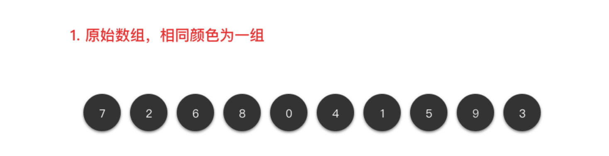
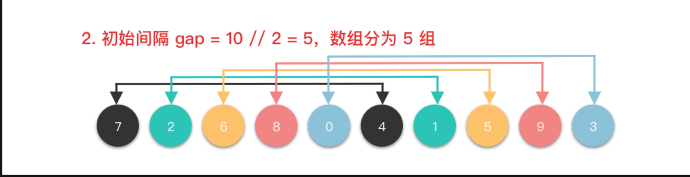
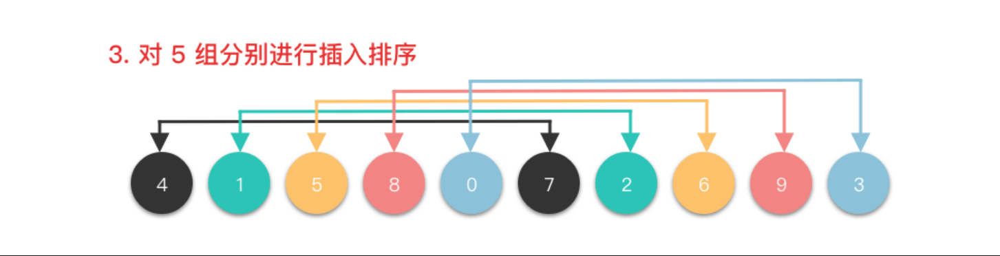
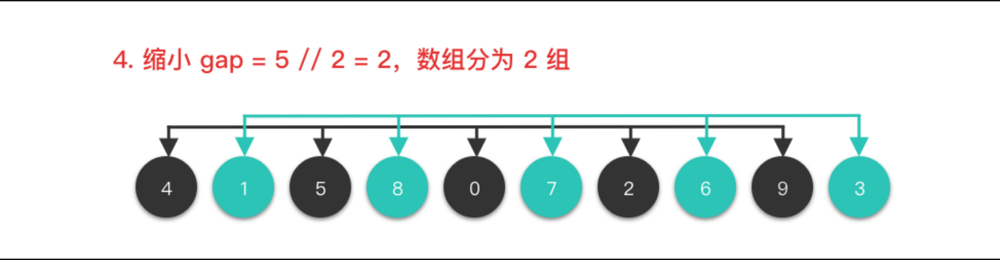
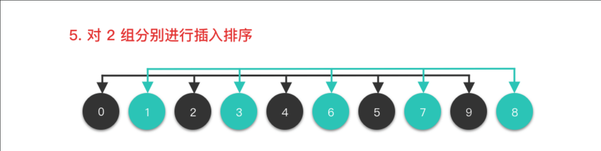
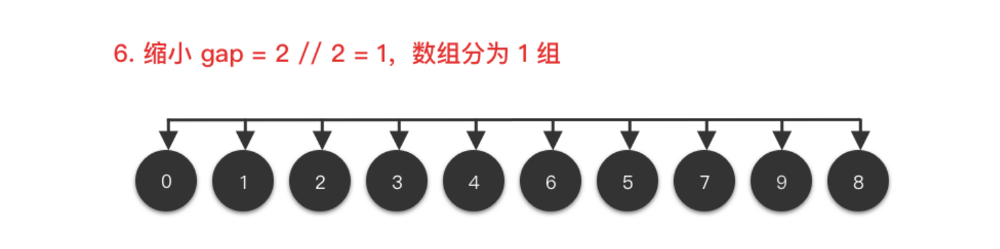
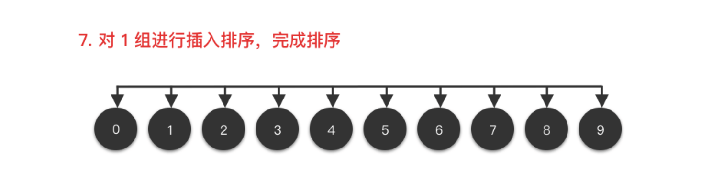

# 排序方法总结
## 冒泡排序

思想较为简单：

1. 遍历数组，将两数比较，左右两个数，大的排在右边
2. 第一趟下来，最大的数就排到了最后
3. 然后在对剩下的绳子进行排序

## 选择排序

”选择最小的数字放到最前面“是选择排序的基本思想。
1. 第一趟选择，遍历数组，选择最小的数字min，与数组中的数字一一比较，然后放到最前面。
2. 对剩下来的数字进行同样的操作。

## 插入排序

将数组分成有序数组和无序数组，总是从无序数组中取出一个插入到有序数组中。

例如：
1. 第一趟数组分成有序[0,0]和无序[1,n-1]，取出nums[1],将其与有序数组每个数字中比较。

    将选中的数字与有序数组中数字比较,代码这样写：
    ```
    j = i
    while j > 0 and nums[j] < nums[j-1] 
        swap(nums[j], nums[j-1])
        j = j-1
2. 对于剩下来的无序数组中的数字重复步骤

## 希尔排序
将整个数组根据间隔数分成若干个子数组，分别对每个子数组进行插入排序，不断缩小间隔，进行下一轮子数组划分，重复进行插入排序，最后间隔数为1，然后对整个数组进行插入排序。然后得到完整的排序数组















## 快速排序

待写.....